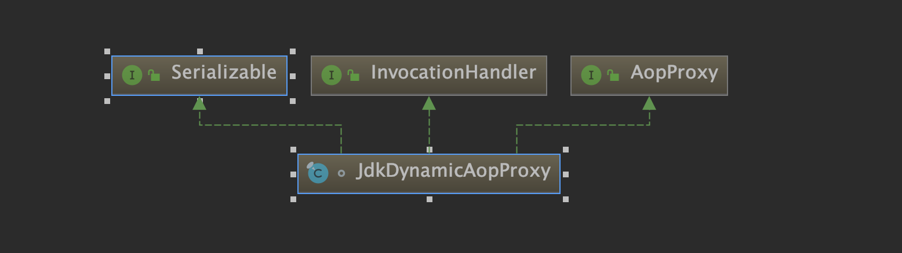
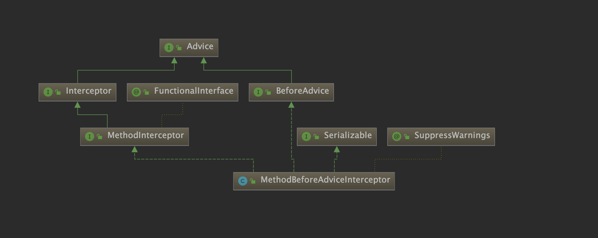
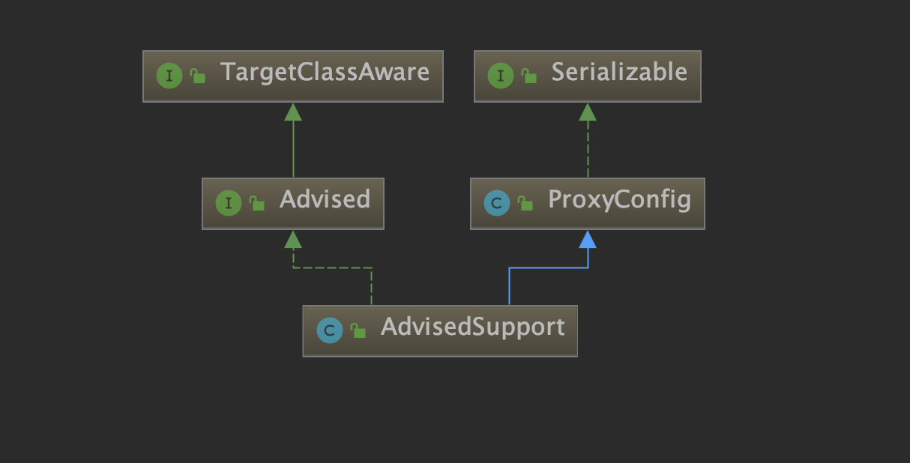
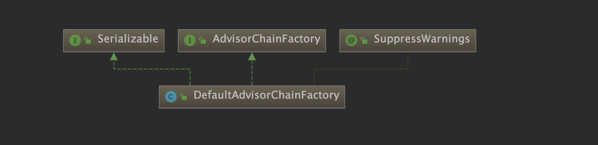
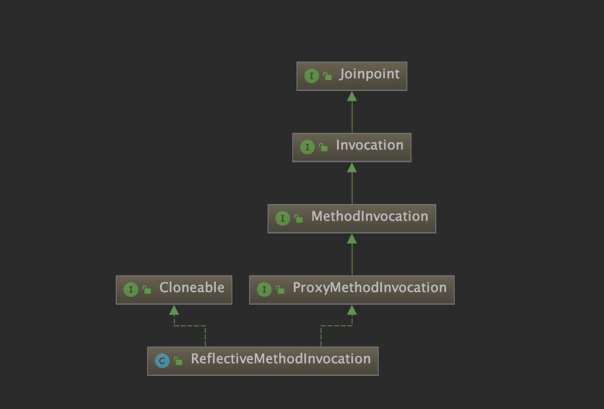
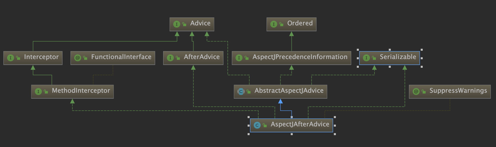
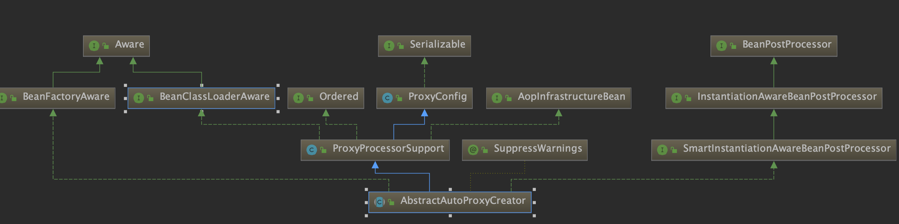

JdkDynamicAopProxy



JdkDynamicAopProxy.invoke

```java
public Object invoke(Object proxy, Method method, Object[] args) throws Throwable {
		Object oldProxy = null;
		boolean setProxyContext = false;

		TargetSource targetSource = this.advised.targetSource;
		Object target = null;

		try {
			if (!this.equalsDefined && AopUtils.isEqualsMethod(method)) {
				// The target does not implement the equals(Object) method itself.
				return equals(args[0]);
			}
			else if (!this.hashCodeDefined && AopUtils.isHashCodeMethod(method)) {
				// The target does not implement the hashCode() method itself.
				return hashCode();
			}
			else if (method.getDeclaringClass() == DecoratingProxy.class) {
				// There is only getDecoratedClass() declared -> dispatch to proxy config.
				return AopProxyUtils.ultimateTargetClass(this.advised);
			}
			else if (!this.advised.opaque && method.getDeclaringClass().isInterface() &&
					method.getDeclaringClass().isAssignableFrom(Advised.class)) {
				// Service invocations on ProxyConfig with the proxy config...
				return AopUtils.invokeJoinpointUsingReflection(this.advised, method, args);
			}

			Object retVal;

            // 如果 expose-proxy 属性为 true，则暴露代理对象
			if (this.advised.exposeProxy) {
				// 向 AopContext 中设置代理对象
				oldProxy = AopContext.setCurrentProxy(proxy);
				setProxyContext = true;
			}

			// Get as late as possible to minimize the time we "own" the target,
			// in case it comes from a pool.
			target = targetSource.getTarget();
			Class<?> targetClass = (target != null ? target.getClass() : null);

			// 获取适合当前方法的拦截器
			List<Object> chain = this.advised.getInterceptorsAndDynamicInterceptionAdvice(method, targetClass);

			// 如果拦截器链为空，则直接执行目标方法
			if (chain.isEmpty()) {
				// 通过反射执行目标方法
				Object[] argsToUse = AopProxyUtils.adaptArgumentsIfNecessary(method, args);
				retVal = AopUtils.invokeJoinpointUsingReflection(target, method, argsToUse);
			}
			else {
				// 创建一个方法调用器，并将拦截器链传入其中
				MethodInvocation invocation =
						new ReflectiveMethodInvocation(proxy, target, method, args, targetClass, chain);
				// 执行拦截器链
				retVal = invocation.proceed();
			}

			// 获取方法返回值类型
			Class<?> returnType = method.getReturnType();
			if (retVal != null && retVal == target &&
					returnType != Object.class && returnType.isInstance(proxy) &&
					!RawTargetAccess.class.isAssignableFrom(method.getDeclaringClass())) {
				// 如果方法返回值为 this，即 return this; 则将代理对象 proxy 赋值给 retVal 
				retVal = proxy;
			}
			// 如果返回值类型为基础类型，比如 int，long 等，当返回值为 null，抛出异常
			else if (retVal == null && returnType != Void.TYPE && returnType.isPrimitive()) {
				throw new AopInvocationException(
						"Null return value from advice does not match primitive return type for: " + method);
			}
			return retVal;
		}
		finally {
			if (target != null && !targetSource.isStatic()) {
				// Must have come from TargetSource.
				targetSource.releaseTarget(target);
			}
			if (setProxyContext) {
				// Restore old proxy.
				AopContext.setCurrentProxy(oldProxy);
			}
		}
	}
```

MethodBeforeAdviceInterceptor



```java
public class MethodBeforeAdviceInterceptor implements MethodInterceptor, BeforeAdvice, Serializable {

    /** 前置通知 */
	private final MethodBeforeAdvice advice;


	/**
	 * Create a new MethodBeforeAdviceInterceptor for the given advice.
	 * @param advice the MethodBeforeAdvice to wrap
	 */
	public MethodBeforeAdviceInterceptor(MethodBeforeAdvice advice) {
		Assert.notNull(advice, "Advice must not be null");
		this.advice = advice;
	}


	@Override
	public Object invoke(MethodInvocation mi) throws Throwable {
	     // 执行前置通知逻辑
		this.advice.before(mi.getMethod(), mi.getArguments(), mi.getThis());
		// 通过 MethodInvocation 调用下一个拦截器，若所有拦截器均执行完，则调用目标方法
		return mi.proceed();
	}

}

```

AdvisedSupport



AdvisedSupport.getInterceptorsAndDynamicInterceptionAdvice

```java
public List<Object> getInterceptorsAndDynamicInterceptionAdvice(Method method, @Nullable Class<?> targetClass) {
   
		MethodCacheKey cacheKey = new MethodCacheKey(method);
		 // 从缓存中获取
		List<Object> cached = this.methodCache.get(cacheKey);
		// 缓存未命中，则进行下一步处理
		if (cached == null) {
			cached = this.advisorChainFactory.getInterceptorsAndDynamicInterceptionAdvice(
					this, method, targetClass);
			this.methodCache.put(cacheKey, cached);
		}
		return cached;
	}
```

DefaultAdvisorChainFactory



```java
public List<Object> getInterceptorsAndDynamicInterceptionAdvice(
			Advised config, Method method, @Nullable Class<?> targetClass) {

		// registry 为 DefaultAdvisorAdapterRegistry 类型
		AdvisorAdapterRegistry registry = GlobalAdvisorAdapterRegistry.getInstance();
		Advisor[] advisors = config.getAdvisors();
		List<Object> interceptorList = new ArrayList<>(advisors.length);
		Class<?> actualClass = (targetClass != null ? targetClass : method.getDeclaringClass());
		Boolean hasIntroductions = null;

		// 遍历通知器列表
		for (Advisor advisor : advisors) {
			if (advisor instanceof PointcutAdvisor) {
				// Add it conditionally.
				PointcutAdvisor pointcutAdvisor = (PointcutAdvisor) advisor;
				/*
                             * 调用 ClassFilter 对 bean 类型进行匹配，无法匹配则说明当前通知器
                             * 不适合应用在当前 bean 上
                             */
				if (config.isPreFiltered() || pointcutAdvisor.getPointcut().getClassFilter().matches(actualClass)) {
				   
					MethodMatcher mm = pointcutAdvisor.getPointcut().getMethodMatcher();
					boolean match;
					// 通过方法匹配器对目标方法进行匹配
					if (mm instanceof IntroductionAwareMethodMatcher) {
						if (hasIntroductions == null) {
							hasIntroductions = hasMatchingIntroductions(advisors, actualClass);
						}
						match = ((IntroductionAwareMethodMatcher) mm).matches(method, actualClass, hasIntroductions);
					}
					else {
						match = mm.matches(method, actualClass);
					}
					if (match) {
					     // 将 advisor 中的 advice 转成相应的拦截器
						MethodInterceptor[] interceptors = registry.getInterceptors(advisor);
						// 若 isRuntime 返回 true，则表明 MethodMatcher 要在运行时做一些检测
						if (mm.isRuntime()) {
							// Creating a new object instance in the getInterceptors() method
							// isn't a problem as we normally cache created chains.
							for (MethodInterceptor interceptor : interceptors) {
								interceptorList.add(new InterceptorAndDynamicMethodMatcher(interceptor, mm));
							}
						}
						else {
							interceptorList.addAll(Arrays.asList(interceptors));
						}
					}
				}
			}
			else if (advisor instanceof IntroductionAdvisor) {
				IntroductionAdvisor ia = (IntroductionAdvisor) advisor;
				// IntroductionAdvisor 类型的通知器，仅需进行类级别的匹配即可
				if (config.isPreFiltered() || ia.getClassFilter().matches(actualClass)) {
					Interceptor[] interceptors = registry.getInterceptors(advisor);
					interceptorList.addAll(Arrays.asList(interceptors));
				}
			}
			else {
				Interceptor[] interceptors = registry.getInterceptors(advisor);
				interceptorList.addAll(Arrays.asList(interceptors));
			}
		}

		return interceptorList;
	}
```

ReflectiveMethodInvocation



ReflectiveMethodInvocation.proceed

```java
public Object proceed() throws Throwable {
		// 拦截器链中的最后一个拦截器执行完后，即可执行目标方法
		if (this.currentInterceptorIndex == this.interceptorsAndDynamicMethodMatchers.size() - 1) {
			return invokeJoinpoint();
		}

		Object interceptorOrInterceptionAdvice =
				this.interceptorsAndDynamicMethodMatchers.get(++this.currentInterceptorIndex);
		if (interceptorOrInterceptionAdvice instanceof InterceptorAndDynamicMethodMatcher) {
			// Evaluate dynamic method matcher here: static part will already have
			// been evaluated and found to match.
			InterceptorAndDynamicMethodMatcher dm =
					(InterceptorAndDynamicMethodMatcher) interceptorOrInterceptionAdvice;
			Class<?> targetClass = (this.targetClass != null ? this.targetClass : this.method.getDeclaringClass());
			 /*
                         * 调用具有三个参数（3-args）的 matches 方法动态匹配目标方法，
                         * 两个参数（2-args）的 matches 方法用于静态匹配
                         */
			if (dm.methodMatcher.matches(this.method, targetClass, this.arguments)) {
			    // 调用拦截器逻辑
				return dm.interceptor.invoke(this);
			}
			else {
				// 如果匹配失败，则忽略当前的拦截器
				return proceed();
			}
		}
		else {
			 // 调用拦截器逻辑，并传递 ReflectiveMethodInvocation 对象
			return ((MethodInterceptor) interceptorOrInterceptionAdvice).invoke(this);
		}
	}
```

AspectJAfterAdvice



```java
public class AspectJAfterAdvice extends AbstractAspectJAdvice
		implements MethodInterceptor, AfterAdvice, Serializable {

	public AspectJAfterAdvice(
			Method aspectJBeforeAdviceMethod, AspectJExpressionPointcut pointcut, AspectInstanceFactory aif) {

		super(aspectJBeforeAdviceMethod, pointcut, aif);
	}


	@Override
	public Object invoke(MethodInvocation mi) throws Throwable {
		try {
			return mi.proceed();
		}
		finally {
		    // 调用后置通知逻辑
			invokeAdviceMethod(getJoinPointMatch(), null, null);
		}
	}

	@Override
	public boolean isBeforeAdvice() {
		return false;
	}

	@Override
	public boolean isAfterAdvice() {
		return true;
	}

}
```

AbstractAutoProxyCreator



```java

```