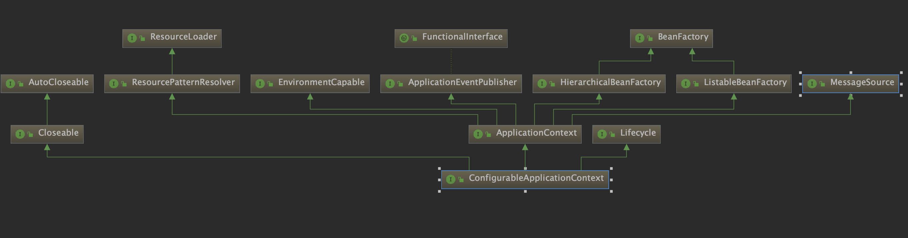
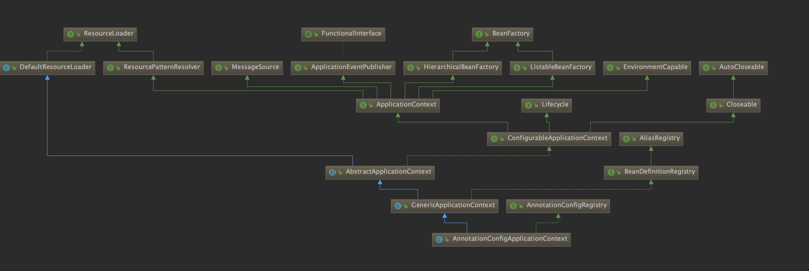
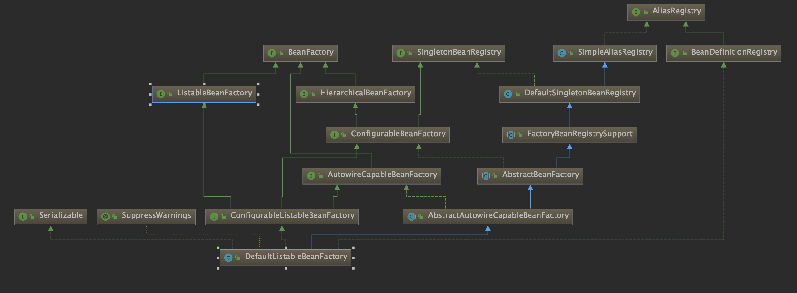
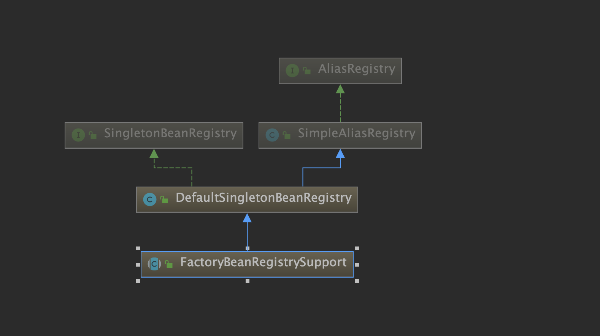
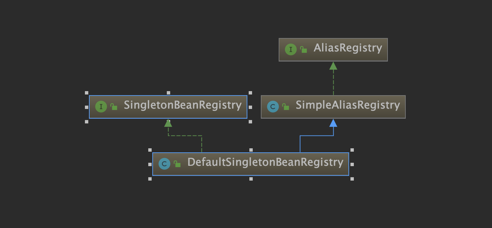
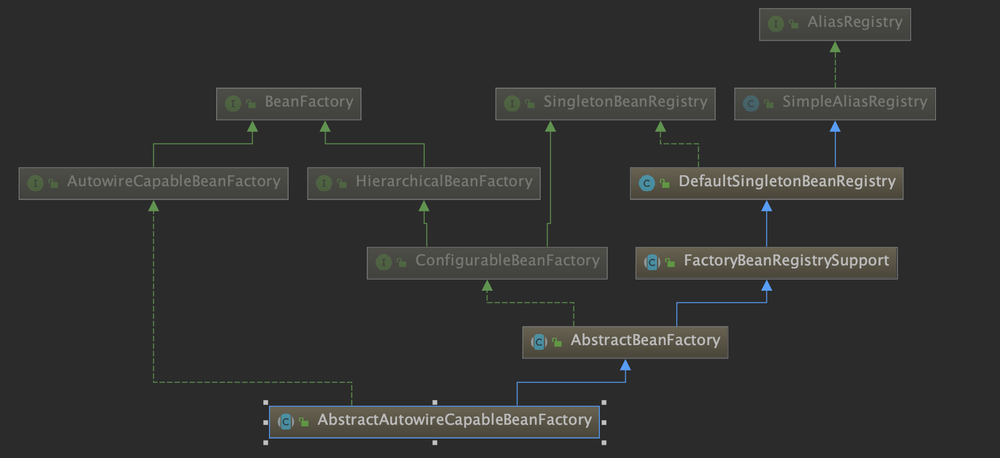

springboot 启动类

SpringApplication 构造方法

```java
public SpringApplication(ResourceLoader resourceLoader, Class<?>... primarySources) {
		this.resourceLoader = resourceLoader;
		Assert.notNull(primarySources, "PrimarySources must not be null");
		this.primarySources = new LinkedHashSet<>(Arrays.asList(primarySources));
		this.webApplicationType = WebApplicationType.deduceFromClasspath();
		setInitializers((Collection) getSpringFactoriesInstances(ApplicationContextInitializer.class));
		setListeners((Collection) getSpringFactoriesInstances(ApplicationListener.class));
		this.mainApplicationClass = deduceMainApplicationClass();
	}
```

设置应用上下文初始化器setInitializers

```java
public void setInitializers(Collection<? extends ApplicationContextInitializer<?>> initializers) {
    this.initializers = new ArrayList<>();
    this.initializers.addAll(initializers);
}
```

ApplicationContextInitializer

作用：ApplicationContextInitializer接口的作用就是在spring prepareContext的时候做一些初始化工作，在spring 初始化的过程中 执行prepareContext方法的时候里面会通过applyInitializers方法回调所有ApplicationContextInitializer接口的实现。所以在SpringApplication的构造方法中执行了setInitializers方法，该方法是把初始化的ApplicationContextInitializer实现类全部加载到SpringApplication内部的集合中。

实现：这些初始化器(initializers)是Spring Boot从本地的META-INF/spring.factories文件和jar文件中的META-INF/spring.factories 文件获取配置的初始化类（注意这边是获取了配置文件的全部配置类），然后通过loadSpringFactories(classLoader).getOrDefault(factoryClassName, Collections.emptyList());

番外：SpringFactroiesLoader在执行方法loadSpringFactories，会把spring项目下所有的spring.factories文件中的类加载，例如 spring-boot-starter-xxx 之类的依赖包。
```java
public interface ApplicationContextInitializer<C extends ConfigurableApplicationContext> {

	/**
	 * Initialize the given application context.
	 * @param applicationContext the application to configure
	 */
	void initialize(C applicationContext);

}
```

deduceMainApplicationClass 可以获取当前运行的所有栈方法

```java
private Class<?> deduceMainApplicationClass() {
		try {
			StackTraceElement[] stackTrace = new RuntimeException().getStackTrace();
			for (StackTraceElement stackTraceElement : stackTrace) {
				if ("main".equals(stackTraceElement.getMethodName())) {
					return Class.forName(stackTraceElement.getClassName());
				}
			}
		}
		catch (ClassNotFoundException ex) {
			// Swallow and continue
		}
		return null;
	}
```

ConfigurableApplicationContext



AnnotationConfigApplicationContext



DefaultListableBeanFactory 函数式编程代码

```java
private void updateManualSingletonNames(Consumer<Set<String>> action, Predicate<Set<String>> condition) {
		if (hasBeanCreationStarted()) {
			// Cannot modify startup-time collection elements anymore (for stable iteration)
			synchronized (this.beanDefinitionMap) {
				if (condition.test(this.manualSingletonNames)) {
					Set<String> updatedSingletons = new LinkedHashSet<>(this.manualSingletonNames);
					action.accept(updatedSingletons);
					this.manualSingletonNames = updatedSingletons;
				}
			}
		}
		else {
			// Still in startup registration phase
			if (condition.test(this.manualSingletonNames)) {
				action.accept(this.manualSingletonNames);
			}
		}
	}

@Override
	public void registerSingleton(String beanName, Object singletonObject) throws IllegalStateException {
		super.registerSingleton(beanName, singletonObject);
		updateManualSingletonNames(set -> set.add(beanName), set -> !this.beanDefinitionMap.containsKey(beanName));
		clearByTypeCache();
	}

	@Override
	public void destroySingletons() {
		super.destroySingletons();
		updateManualSingletonNames(Set::clear, set -> !set.isEmpty());
		clearByTypeCache();
	}
```

DefaultListableBeanFactory



DefaultSingletonBeanRegistry.singletonObjects: 用于存放完全初始化好的 bean，从该缓存中取出的 bean 可以直接使用
DefaultSingletonBeanRegistry.singletonFactories: 存放 bean 工厂对象，用于解决循环依赖
DefaultSingletonBeanRegistry.earlySingletonObjects: 存放原始的 bean 对象（尚未填充属性），用于解决循环依赖

AbstractBeanFactory.doGetBean

```java
protected <T> T doGetBean(final String name, @Nullable final Class<T> requiredType,
			@Nullable final Object[] args, boolean typeCheckOnly) throws BeansException {

        /*
         * 通过 name 获取 beanName。这里不使用 name 直接作为 beanName 有两点原因：
         * 1. name 可能会以 & 字符开头，表明调用者想获取 FactoryBean 本身，而非 FactoryBean 
         *    实现类所创建的 bean。在 BeanFactory 中，FactoryBean 的实现类和其他的 bean 存储
         *    方式是一致的，即 <beanName, bean>，beanName 中是没有 & 这个字符的。所以我们需要
         *    将 name 的首字符 & 移除，这样才能从缓存里取到 FactoryBean 实例。
         * 2. 若 name 是一个别名，则应将别名转换为具体的实例名，也就是 beanName。
         */
		final String beanName = transformedBeanName(name);
		Object bean;

		// Eagerly check singleton cache for manually registered singletons.
		Object sharedInstance = getSingleton(beanName);
		if (sharedInstance != null && args == null) {
			if (logger.isTraceEnabled()) {
				if (isSingletonCurrentlyInCreation(beanName)) {
					logger.trace("Returning eagerly cached instance of singleton bean '" + beanName +
							"' that is not fully initialized yet - a consequence of a circular reference");
				}
				else {
					logger.trace("Returning cached instance of singleton bean '" + beanName + "'");
				}
			}
			/*
                             * 如果 sharedInstance 是普通的单例 bean，下面的方法会直接返回。但如果 
                             * sharedInstance 是 FactoryBean 类型的，则需调用 getObject 工厂方法获取真正的 
                             * bean 实例。如果用户想获取 FactoryBean 本身，这里也不会做特别的处理，直接返回
                             * 即可。毕竟 FactoryBean 的实现类本身也是一种 bean，只不过具有一点特殊的功能而已。
                             */
			bean = getObjectForBeanInstance(sharedInstance, name, beanName, null);
		}

		else {
			// Fail if we're already creating this bean instance:
			// We're assumably within a circular reference.
			if (isPrototypeCurrentlyInCreation(beanName)) {
				throw new BeanCurrentlyInCreationException(beanName);
			}
			// 如果 sharedInstance = null，则到父容器中查找 bean 实例
			BeanFactory parentBeanFactory = getParentBeanFactory();
			if (parentBeanFactory != null && !containsBeanDefinition(beanName)) {
				// 获取 name 对应的 beanName，如果 name 是以 & 字符开头，则返回 & + beanName
				String nameToLookup = originalBeanName(name);
				if (parentBeanFactory instanceof AbstractBeanFactory) {
					return ((AbstractBeanFactory) parentBeanFactory).doGetBean(
							nameToLookup, requiredType, args, typeCheckOnly);
				}
				else if (args != null) {
					// Delegation to parent with explicit args.
					return (T) parentBeanFactory.getBean(nameToLookup, args);
				}
				else if (requiredType != null) {
					// No args -> delegate to standard getBean method.
					return parentBeanFactory.getBean(nameToLookup, requiredType);
				}
				else {
					return (T) parentBeanFactory.getBean(nameToLookup);
				}
			}

			if (!typeCheckOnly) {
				markBeanAsCreated(beanName);
			}

			try {
				final RootBeanDefinition mbd = getMergedLocalBeanDefinition(beanName);
				checkMergedBeanDefinition(mbd, beanName, args);

				// Guarantee initialization of beans that the current bean depends on.
				String[] dependsOn = mbd.getDependsOn();
				if (dependsOn != null) {
					for (String dep : dependsOn) {
					    // 如果循环依赖抛出异常
						if (isDependent(beanName, dep)) {
							throw new BeanCreationException(mbd.getResourceDescription(), beanName,
									"Circular depends-on relationship between '" + beanName + "' and '" + dep + "'");
						}
						registerDependentBean(dep, beanName);
						try {
							getBean(dep);
						}
						catch (NoSuchBeanDefinitionException ex) {
							throw new BeanCreationException(mbd.getResourceDescription(), beanName,
									"'" + beanName + "' depends on missing bean '" + dep + "'", ex);
						}
					}
				}

				// Create bean instance.
				if (mbd.isSingleton()) {
				    // 调用 DefaultSingletonBeanRegistry.getSingleton
					sharedInstance = getSingleton(beanName, () -> {
						try {
						    // 最终调用 AbstractAutowireCapableBeanFatory.doCreateBean, 
							return createBean(beanName, mbd, args);
						}
						catch (BeansException ex) {
							// Explicitly remove instance from singleton cache: It might have been put there
							// eagerly by the creation process, to allow for circular reference resolution.
							// Also remove any beans that received a temporary reference to the bean.
							destroySingleton(beanName);
							throw ex;
						}
					});
					// 如果 bean 是 FactoryBean 类型，则调用工厂方法获取真正的 bean 实例。否则直接返回 bean 实例
					bean = getObjectForBeanInstance(sharedInstance, name, beanName, mbd);
				}

				else if (mbd.isPrototype()) {
					// It's a prototype -> create a new instance.
					Object prototypeInstance = null;
					try {
						beforePrototypeCreation(beanName);
						prototypeInstance = createBean(beanName, mbd, args);
					}
					finally {
						afterPrototypeCreation(beanName);
					}
					bean = getObjectForBeanInstance(prototypeInstance, name, beanName, mbd);
				}

				else {
					String scopeName = mbd.getScope();
					final Scope scope = this.scopes.get(scopeName);
					if (scope == null) {
						throw new IllegalStateException("No Scope registered for scope name '" + scopeName + "'");
					}
					try {
						Object scopedInstance = scope.get(beanName, () -> {
							beforePrototypeCreation(beanName);
							try {
								return createBean(beanName, mbd, args);
							}
							finally {
								afterPrototypeCreation(beanName);
							}
						});
						bean = getObjectForBeanInstance(scopedInstance, name, beanName, mbd);
					}
					catch (IllegalStateException ex) {
						throw new BeanCreationException(beanName,
								"Scope '" + scopeName + "' is not active for the current thread; consider " +
								"defining a scoped proxy for this bean if you intend to refer to it from a singleton",
								ex);
					}
				}
			}
			catch (BeansException ex) {
				cleanupAfterBeanCreationFailure(beanName);
				throw ex;
			}
		}

		// Check if required type matches the type of the actual bean instance.
		if (requiredType != null && !requiredType.isInstance(bean)) {
			try {
				T convertedBean = getTypeConverter().convertIfNecessary(bean, requiredType);
				if (convertedBean == null) {
					throw new BeanNotOfRequiredTypeException(name, requiredType, bean.getClass());
				}
				return convertedBean;
			}
			catch (TypeMismatchException ex) {
				if (logger.isTraceEnabled()) {
					logger.trace("Failed to convert bean '" + name + "' to required type '" +
							ClassUtils.getQualifiedName(requiredType) + "'", ex);
				}
				throw new BeanNotOfRequiredTypeException(name, requiredType, bean.getClass());
			}
		}
		return (T) bean;
	}
```

AbstractBeanFactory.getSingleton

```java
protected Object getSingleton(String beanName, boolean allowEarlyReference) {
        // 从 singletonObjects 获取实例，singletonObjects 中缓存的实例都是完全实例化好的 bean，可以直接使用
		Object singletonObject = this.singletonObjects.get(beanName);
		/*
             * 如果 singletonObject = null，表明还没创建，或者还没完全创建好。
             * 这里判断 beanName 对应的 bean 是否正在创建中
             */
		if (singletonObject == null && isSingletonCurrentlyInCreation(beanName)) {
			synchronized (this.singletonObjects) {
			     // 从 earlySingletonObjects 中获取提前曝光的 bean
				singletonObject = this.earlySingletonObjects.get(beanName);
				if (singletonObject == null && allowEarlyReference) {
				    // 获取相应的 bean 工厂
					ObjectFactory<?> singletonFactory = this.singletonFactories.get(beanName);
					if (singletonFactory != null) {
					    // 提前曝光 bean 实例（raw bean），用于解决循环依赖
						singletonObject = singletonFactory.getObject();
						this.earlySingletonObjects.put(beanName, singletonObject);
						this.singletonFactories.remove(beanName);
					}
				}
			}
		}
		return singletonObject;
	}
```

AbstractBeanFactory.getMergedBeanDefinition

```java
protected RootBeanDefinition getMergedBeanDefinition(
			String beanName, BeanDefinition bd, @Nullable BeanDefinition containingBd)
			throws BeanDefinitionStoreException {

		synchronized (this.mergedBeanDefinitions) {
			RootBeanDefinition mbd = null;

			// Check with full lock now in order to enforce the same merged instance.
			if (containingBd == null) {
				mbd = this.mergedBeanDefinitions.get(beanName);
			}

			if (mbd == null) {
			    // 表明无父配置，这时直接将当前的 BeanDefinition 升级为 RootBeanDefinition
				if (bd.getParentName() == null) {
					// Use copy of given root bean definition.
					if (bd instanceof RootBeanDefinition) {
						mbd = ((RootBeanDefinition) bd).cloneBeanDefinition();
					}
					else {
						mbd = new RootBeanDefinition(bd);
					}
				}
				else {
					// Child bean definition: needs to be merged with parent.
					BeanDefinition pbd;
					try {
					    /*
                                             * 判断父类 beanName 与子类 beanName 名称是否相同。若相同，则父类 bean 一定
                                             * 在父容器中。原因也很简单，容器底层是用 Map 缓存 <beanName, bean> 键值对
                                             * 的。同一个容器下，使用同一个 beanName 映射两个 bean 实例显然是不合适的。
                                             * 有的朋友可能会觉得可以这样存储：<beanName, [bean1, bean2]> ，似乎解决了
                                             * 一对多的问题。但是也有问题，调用 getName(beanName) 时，到底返回哪个 bean 
                                             * 实例好呢？
                                             */
						String parentBeanName = transformedBeanName(bd.getParentName());
						if (!beanName.equals(parentBeanName)) {
							pbd = getMergedBeanDefinition(parentBeanName);
						}
						else {
							BeanFactory parent = getParentBeanFactory();
							if (parent instanceof ConfigurableBeanFactory) {
								pbd = ((ConfigurableBeanFactory) parent).getMergedBeanDefinition(parentBeanName);
							}
							else {
								throw new NoSuchBeanDefinitionException(parentBeanName,
										"Parent name '" + parentBeanName + "' is equal to bean name '" + beanName +
										"': cannot be resolved without an AbstractBeanFactory parent");
							}
						}
					}
					catch (NoSuchBeanDefinitionException ex) {
						throw new BeanDefinitionStoreException(bd.getResourceDescription(), beanName,
								"Could not resolve parent bean definition '" + bd.getParentName() + "'", ex);
					}
					// 以父 BeanDefinition 的配置信息为蓝本创建 RootBeanDefinition，也就是“已合并的 BeanDefinition”
					mbd = new RootBeanDefinition(pbd);
					// 用子 BeanDefinition 中的属性覆盖父 BeanDefinition 中的属性
					mbd.overrideFrom(bd);
				}

				// Set default singleton scope, if not configured before.
				if (!StringUtils.hasLength(mbd.getScope())) {
					mbd.setScope(RootBeanDefinition.SCOPE_SINGLETON);
				}

				// A bean contained in a non-singleton bean cannot be a singleton itself.
				// Let's correct this on the fly here, since this might be the result of
				// parent-child merging for the outer bean, in which case the original inner bean
				// definition will not have inherited the merged outer bean's singleton status.
				if (containingBd != null && !containingBd.isSingleton() && mbd.isSingleton()) {
					mbd.setScope(containingBd.getScope());
				}

				// Cache the merged bean definition for the time being
				// (it might still get re-merged later on in order to pick up metadata changes)
				if (containingBd == null && isCacheBeanMetadata()) {
					this.mergedBeanDefinitions.put(beanName, mbd);
				}
			}

			return mbd;
		}
	}
```

AbstractBeanFactory.getObjectForBeanInstance

```java
protected Object getObjectForBeanInstance(
			Object beanInstance, String name, String beanName, @Nullable RootBeanDefinition mbd) {

		// Don't let calling code try to dereference the factory if the bean isn't a factory.
		if (BeanFactoryUtils.isFactoryDereference(name)) {
			if (beanInstance instanceof NullBean) {
				return beanInstance;
			}
			if (!(beanInstance instanceof FactoryBean)) {
				throw new BeanIsNotAFactoryException(beanName, beanInstance.getClass());
			}
		}

		 /**
		   * <p>普通 bean, 没有实现 FactoryBean 接口
		   * <p>直接返回 FactoryBean 实例
           */
		if (!(beanInstance instanceof FactoryBean) || BeanFactoryUtils.isFactoryDereference(name)) {
			return beanInstance;
		}

		Object object = null;
		if (mbd == null) {
		     /*
                     * 如果 mbd 为空，则从缓存中加载 bean。FactoryBean 生成的单例 bean 会被缓存
                     * 在 factoryBeanObjectCache 集合中，不用每次都创建
                     */
			object = getCachedObjectForFactoryBean(beanName);
		}
		if (object == null) {
			// Return bean instance from factory.
			FactoryBean<?> factory = (FactoryBean<?>) beanInstance;
			// 如果 mbd 为空，则判断是否存在名字为 beanName 的 BeanDefinition
			if (mbd == null && containsBeanDefinition(beanName)) {
			    // 合并 BeanDefinition
				mbd = getMergedLocalBeanDefinition(beanName);
			}
			// synthetic 字面意思是"合成的"。通过全局查找，我发现在 AOP 相关的类中会将该属性设为 true。
                    // 所以我觉得该字段可能表示某个 bean 是不是被 AOP 增强过，也就是 AOP 基于原始类合成了一个新的代理类。
			boolean synthetic = (mbd != null && mbd.isSynthetic());
			object = getObjectFromFactoryBean(factory, beanName, !synthetic);
		}
		return object;
	}
```

FactoryBeanRegistrySupport



FactoryBeanRegistrySupport.getObjectFromFactoryBean

```java
protected Object getObjectFromFactoryBean(FactoryBean<?> factory, String beanName, boolean shouldPostProcess) {
    /*
         * FactoryBean 也有单例和非单例之分，针对不同类型的 FactoryBean，这里有两种处理方式：
         *   1. 单例 FactoryBean 生成的 bean 实例也认为是单例类型。需放入缓存中，供后续重复使用
         *   2. 非单例 FactoryBean 生成的 bean 实例则不会被放入缓存中，每次都会创建新的实例
         */
		if (factory.isSingleton() && containsSingleton(beanName)) {
			synchronized (getSingletonMutex()) {
			    // 从缓存中取 bean 实例，避免多次创建 bean 实例
				Object object = this.factoryBeanObjectCache.get(beanName);
				if (object == null) {
					object = doGetObjectFromFactoryBean(factory, beanName);
					// Only post-process and store if not put there already during getObject() call above
					// (e.g. because of circular reference processing triggered by custom getBean calls)
					Object alreadyThere = this.factoryBeanObjectCache.get(beanName);
					if (alreadyThere != null) {
						object = alreadyThere;
					}
					else {
						if (shouldPostProcess) {
							if (isSingletonCurrentlyInCreation(beanName)) {
								// Temporarily return non-post-processed object, not storing it yet..
								return object;
							}
							beforeSingletonCreation(beanName);
							try {
								object = postProcessObjectFromFactoryBean(object, beanName);
							}
							catch (Throwable ex) {
								throw new BeanCreationException(beanName,
										"Post-processing of FactoryBean's singleton object failed", ex);
							}
							finally {
								afterSingletonCreation(beanName);
							}
						}
						if (containsSingleton(beanName)) {
							this.factoryBeanObjectCache.put(beanName, object);
						}
					}
				}
				return object;
			}
		}
		else {
			Object object = doGetObjectFromFactoryBean(factory, beanName);
			if (shouldPostProcess) {
				try {
					object = postProcessObjectFromFactoryBean(object, beanName);
				}
				catch (Throwable ex) {
					throw new BeanCreationException(beanName, "Post-processing of FactoryBean's object failed", ex);
				}
			}
			return object;
		}
	}
```

FactoryBeanRegistrySupport.doGetObjectFromFactoryBean

```java
private Object doGetObjectFromFactoryBean(final FactoryBean<?> factory, final String beanName)
			throws BeanCreationException {

		Object object;
		try {
			if (System.getSecurityManager() != null) {
				AccessControlContext acc = getAccessControlContext();
				try {
					object = AccessController.doPrivileged((PrivilegedExceptionAction<Object>) factory::getObject, acc);
				}
				catch (PrivilegedActionException pae) {
					throw pae.getException();
				}
			}
			else {
			    // invoke BeanFactory 的 getObject 方法
				object = factory.getObject();
			}
		}
		catch (FactoryBeanNotInitializedException ex) {
			throw new BeanCurrentlyInCreationException(beanName, ex.toString());
		}
		catch (Throwable ex) {
			throw new BeanCreationException(beanName, "FactoryBean threw exception on object creation", ex);
		}

		// Do not accept a null value for a FactoryBean that's not fully
		// initialized yet: Many FactoryBeans just return null then.
		if (object == null) {
			if (isSingletonCurrentlyInCreation(beanName)) {
				throw new BeanCurrentlyInCreationException(
						beanName, "FactoryBean which is currently in creation returned null from getObject");
			}
			// 创建 NullBean
			object = new NullBean();
		}
		return object;
	}
```

DefaultSingletonBeanRegistry



DefaultSingletonBeanRegistry.getSingleton

```java
public Object getSingleton(String beanName, ObjectFactory<?> singletonFactory) {
		Assert.notNull(beanName, "Bean name must not be null");
		synchronized (this.singletonObjects) {
			Object singletonObject = this.singletonObjects.get(beanName);
			if (singletonObject == null) {
				if (this.singletonsCurrentlyInDestruction) {
					throw new BeanCreationNotAllowedException(beanName,
							"Singleton bean creation not allowed while singletons of this factory are in destruction " +
							"(Do not request a bean from a BeanFactory in a destroy method implementation!)");
				}
				if (logger.isDebugEnabled()) {
					logger.debug("Creating shared instance of singleton bean '" + beanName + "'");
				}
				/* 
                             * 将 beanName 添加到 singletonsCurrentlyInCreation 集合中，
                             * 用于表明 beanName 对应的 bean 正在创建中
                             */
				beforeSingletonCreation(beanName);
				boolean newSingleton = false;
				boolean recordSuppressedExceptions = (this.suppressedExceptions == null);
				if (recordSuppressedExceptions) {
					this.suppressedExceptions = new LinkedHashSet<>();
				}
				try {
				    // 
					singletonObject = singletonFactory.getObject();
					newSingleton = true;
				}
				catch (IllegalStateException ex) {
					// Has the singleton object implicitly appeared in the meantime ->
					// if yes, proceed with it since the exception indicates that state.
					singletonObject = this.singletonObjects.get(beanName);
					if (singletonObject == null) {
						throw ex;
					}
				}
				catch (BeanCreationException ex) {
					if (recordSuppressedExceptions) {
						for (Exception suppressedException : this.suppressedExceptions) {
							ex.addRelatedCause(suppressedException);
						}
					}
					throw ex;
				}
				finally {
					if (recordSuppressedExceptions) {
						this.suppressedExceptions = null;
					}
					afterSingletonCreation(beanName);
				}
				if (newSingleton) {
					addSingleton(beanName, singletonObject);
				}
			}
			return singletonObject;
		}
	}
```

AbstractAutowireCapableBeanFatory



AbstractAutowireCapableBeanFatory.createBean

```java
protected Object createBean(String beanName, RootBeanDefinition mbd, @Nullable Object[] args)
			throws BeanCreationException {

		if (logger.isTraceEnabled()) {
			logger.trace("Creating instance of bean '" + beanName + "'");
		}
		RootBeanDefinition mbdToUse = mbd;

		// Make sure bean class is actually resolved at this point, and
		// clone the bean definition in case of a dynamically resolved Class
		// which cannot be stored in the shared merged bean definition.
		Class<?> resolvedClass = resolveBeanClass(mbd, beanName);
		if (resolvedClass != null && !mbd.hasBeanClass() && mbd.getBeanClassName() != null) {
			mbdToUse = new RootBeanDefinition(mbd);
			mbdToUse.setBeanClass(resolvedClass);
		}

		// Prepare method overrides.
		try {
		    // 处理 lookup-method 和 replace-method 配置，Spring 将这两个配置统称为 override method
			mbdToUse.prepareMethodOverrides();
		}
		catch (BeanDefinitionValidationException ex) {
			throw new BeanDefinitionStoreException(mbdToUse.getResourceDescription(),
					beanName, "Validation of method overrides failed", ex);
		}

		try {
			// 在 bean 初始化前应用后置处理，如果后置处理返回的 bean 不为空，则直接返回
			Object bean = resolveBeforeInstantiation(beanName, mbdToUse);
			if (bean != null) {
				return bean;
			}
		}
		catch (Throwable ex) {
			throw new BeanCreationException(mbdToUse.getResourceDescription(), beanName,
					"BeanPostProcessor before instantiation of bean failed", ex);
		}

		try {
			Object beanInstance = doCreateBean(beanName, mbdToUse, args);
			if (logger.isTraceEnabled()) {
				logger.trace("Finished creating instance of bean '" + beanName + "'");
			}
			return beanInstance;
		}
		catch (BeanCreationException | ImplicitlyAppearedSingletonException ex) {
			// A previously detected exception with proper bean creation context already,
			// or illegal singleton state to be communicated up to DefaultSingletonBeanRegistry.
			throw ex;
		}
		catch (Throwable ex) {
			throw new BeanCreationException(
					mbdToUse.getResourceDescription(), beanName, "Unexpected exception during bean creation", ex);
		}
	}
```

AbstractAutowireCapableBeanFatory.doCreateBean

```java
protected Object doCreateBean(final String beanName, final RootBeanDefinition mbd, final @Nullable Object[] args)
			throws BeanCreationException {

		// Instantiate the bean.
		BeanWrapper instanceWrapper = null;
		if (mbd.isSingleton()) {
			instanceWrapper = this.factoryBeanInstanceCache.remove(beanName);
		}
		if (instanceWrapper == null) {
		    /* 
                     * 创建 bean 实例，并将实例包裹在 BeanWrapper 实现类对象中返回。createBeanInstance 
                     * 中包含三种创建 bean 实例的方式：
                     *   1. 通过工厂方法创建 bean 实例
                     *   2. 通过构造方法自动注入（autowire by constructor）的方式创建 bean 实例
                     *   3. 通过无参构造方法方法创建 bean 实例
                     *
                     * 若 bean 的配置信息中配置了 lookup-method 和 replace-method，则会使用 CGLIB 
                     */
			instanceWrapper = createBeanInstance(beanName, mbd, args);
		}
		final Object bean = instanceWrapper.getWrappedInstance();
		Class<?> beanType = instanceWrapper.getWrappedClass();
		if (beanType != NullBean.class) {
			mbd.resolvedTargetType = beanType;
		}

		// Allow post-processors to modify the merged bean definition.
		synchronized (mbd.postProcessingLock) {
			if (!mbd.postProcessed) {
				try {
					applyMergedBeanDefinitionPostProcessors(mbd, beanType, beanName);
				}
				catch (Throwable ex) {
					throw new BeanCreationException(mbd.getResourceDescription(), beanName,
							"Post-processing of merged bean definition failed", ex);
				}
				mbd.postProcessed = true;
			}
		}

		// Eagerly cache singletons to be able to resolve circular references
		// even when triggered by lifecycle interfaces like BeanFactoryAware.
		boolean earlySingletonExposure = (mbd.isSingleton() && this.allowCircularReferences &&
				isSingletonCurrentlyInCreation(beanName));
		if (earlySingletonExposure) {
			if (logger.isTraceEnabled()) {
				logger.trace("Eagerly caching bean '" + beanName +
						"' to allow for resolving potential circular references");
			}
			// singletonFactories 中添加 ObjectFactory
			// 获取早期 bean 的引用，如果 bean 中的方法被 AOP 切点所匹配到，此时 AOP 相关逻辑会介入
			addSingletonFactory(beanName, () -> getEarlyBeanReference(beanName, mbd, bean));
		}

		// Initialize the bean instance.
		Object exposedObject = bean;
		try {
		    // 填充属性，解析依赖
			populateBean(beanName, mbd, instanceWrapper);
			/*
                         * 进行余下的初始化工作，详细如下：
                         * 1. 判断 bean 是否实现了 BeanNameAware、BeanFactoryAware、
                         *    BeanClassLoaderAware 等接口，并执行接口方法
                         * 2. 应用 bean 初始化前置操作
                         * 3. 如果 bean 实现了 InitializingBean 接口，则执行 afterPropertiesSet 
                         *    方法。如果用户配置了 init-method，则调用相关方法执行自定义初始化逻辑
                         * 4. 应用 bean 初始化后置操作
                         * 
                         * 另外，AOP 相关逻辑也会在该方法中织入切面逻辑，此时的 exposedObject 就变成了
                         * 一个代理对象了
                         */
			exposedObject = initializeBean(beanName, exposedObject, mbd);
		}
		catch (Throwable ex) {
			if (ex instanceof BeanCreationException && beanName.equals(((BeanCreationException) ex).getBeanName())) {
				throw (BeanCreationException) ex;
			}
			else {
				throw new BeanCreationException(
						mbd.getResourceDescription(), beanName, "Initialization of bean failed", ex);
			}
		}

		if (earlySingletonExposure) {
		    // 若 initializeBean 方法未改变 exposedObject 的引用，则此处的条件为 true。
			Object earlySingletonReference = getSingleton(beanName, false);
			if (earlySingletonReference != null) {
				if (exposedObject == bean) {
					exposedObject = earlySingletonReference;
				}
				// 待分析
				else if (!this.allowRawInjectionDespiteWrapping && hasDependentBean(beanName)) {
					String[] dependentBeans = getDependentBeans(beanName);
					Set<String> actualDependentBeans = new LinkedHashSet<>(dependentBeans.length);
					for (String dependentBean : dependentBeans) {
						if (!removeSingletonIfCreatedForTypeCheckOnly(dependentBean)) {
							actualDependentBeans.add(dependentBean);
						}
					}
					if (!actualDependentBeans.isEmpty()) {
						throw new BeanCurrentlyInCreationException(beanName,
								"Bean with name '" + beanName + "' has been injected into other beans [" +
								StringUtils.collectionToCommaDelimitedString(actualDependentBeans) +
								"] in its raw version as part of a circular reference, but has eventually been " +
								"wrapped. This means that said other beans do not use the final version of the " +
								"bean. This is often the result of over-eager type matching - consider using " +
								"'getBeanNamesOfType' with the 'allowEagerInit' flag turned off, for example.");
					}
				}
			}
		}

		// Register bean as disposable.
		try {
			registerDisposableBeanIfNecessary(beanName, bean, mbd);
		}
		catch (BeanDefinitionValidationException ex) {
			throw new BeanCreationException(
					mbd.getResourceDescription(), beanName, "Invalid destruction signature", ex);
		}

		return exposedObject;
	}
```

AbstractBeanFactory.transformedBeanName

```java
protected String transformedBeanName(String name) {
		return canonicalName(BeanFactoryUtils.transformedBeanName(name));
	}

```

BeanFactoryUtils.transformedBeanName

```java
public static String transformedBeanName(String name) {
		Assert.notNull(name, "'name' must not be null");
		if (!name.startsWith(BeanFactory.FACTORY_BEAN_PREFIX)) {
			return name;
		}
		return transformedBeanNameCache.computeIfAbsent(name, beanName -> {
		    // 循环处理 & 字符。比如 name = "&&&&&helloService"，最终会被转成 helloService
		    // beanName 的入参就是 name 
			do {
				beanName = beanName.substring(BeanFactory.FACTORY_BEAN_PREFIX.length());
			}
			while (beanName.startsWith(BeanFactory.FACTORY_BEAN_PREFIX));
			return beanName;
		});
	}
```

SimpleAliasRegistry.canonicalName

```java
public String canonicalName(String name) {
		String canonicalName = name;
		// Handle aliasing...
		String resolvedName;
		/*
             * 这里使用 while 循环进行处理，原因是：可能会存在多重别名的问题，即别名指向别名。比如下面
             * 的配置：
             *   <bean id="hello" class="service.Hello"/>
             *   <alias name="hello" alias="aliasA"/>
             *   <alias name="aliasA" alias="aliasB"/>
             *
             * 上面的别名指向关系为 aliasB -> aliasA -> hello，对于上面的别名配置，aliasMap 中数据
             * 视图为：aliasMap = [<aliasB, aliasA>, <aliasA, hello>]。通过下面的循环解析别名
             * aliasB 最终指向的 beanName
             */
		do {
			resolvedName = this.aliasMap.get(canonicalName);
			if (resolvedName != null) {
				canonicalName = resolvedName;
			}
		}
		while (resolvedName != null);
		return canonicalName;
	}
```
